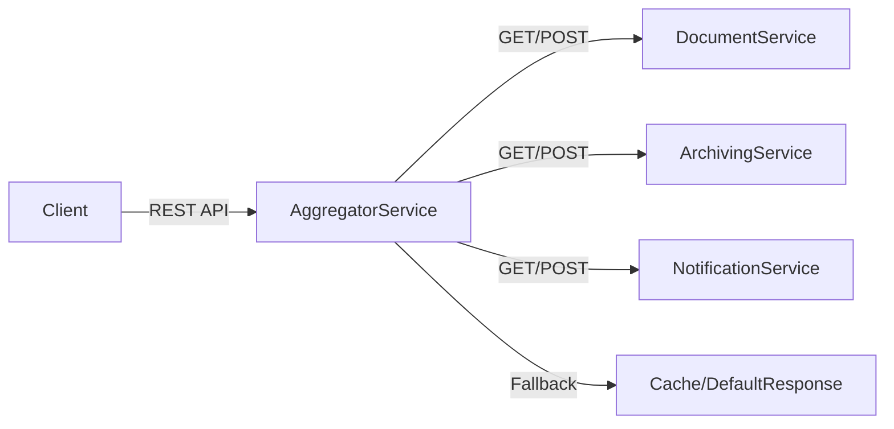

# 📌 Projet : Microservices Aggregator avec Circuit Breaker

## 🚀 Description

Ce projet est une application **Spring Boot** qui agit comme un **agrégateur de microservices**.
Il permet de centraliser les appels vers plusieurs services indépendants (**Document Service**, **Archiving Service**, **Notification Service**), tout en assurant :

* Une **tolérance aux pannes** grâce à **Resilience4j Circuit Breaker**.
* Une gestion simple des **endpoints** via **WebClient** et des URLs configurées dans `application.yml`.
* Une architecture **scalable et résiliente** adaptée aux environnements distribués (Kubernetes, Docker, etc.).

---

## 🏗️ Architecture



---

## ⚙️ Fonctionnalités principales

* ✅ **Agrégation d’appels** vers plusieurs microservices.
* ✅ **Resilience4j Circuit Breaker** pour gérer :

    * Nombre d’échecs avant ouverture (ex. 2).
    * Temps d’attente avant passage en Half-Open (ex. 10s).
* ✅ **Configuration dynamique des URLs** via `application.yml` ou variables d’environnement.
* ✅ **Gestion des erreurs** avec des **fallbacks élégants**.
* ✅ API REST simple pour récupérer et archiver les données.

---

## 📂 Structure du projet

```
src/main/java/com/example/aggregator
│── config/          # Configuration WebClient & CircuitBreaker
│── web/      # Contrôleurs REST exposant les endpoints
│── service/         # Services métier (agrégation, archive, etc.)
│── security/          # pour manager la securite des endpoints
│── model/       # Gestion des modeles
```

---

## 🛠️ Configuration

### `application.yml`

```yaml
config:
  document-service: ${URL_DOCUMENT:http://document-service}
  archiving-service: ${URL_ARCHIVE:http://archiving-service}
  notification-service: ${URL_NOTIFICATION:http://notification-service}

resilience4j:
  circuitbreaker:
    instances:
      aggregationService:
        slidingWindowSize: 5
        minimumNumberOfCalls: 2
        failureRateThreshold: 50
        waitDurationInOpenState: 10s
        permittedNumberOfCallsInHalfOpenState: 2
```

---

## 📌 Exemple d’utilisation

### Endpoint : `/api/aggregate`

📥 **Requête**

```http
GET /api/clients?clientId=123
```

📤 **Réponse**

```json
{
  "clientId": "C12345",
  "documents": [
    {"id": "D001", "title": "Contrat Auto", "status": "Actif"},
    {"id": "D002", "title": "Contrat Habitation", "status": "Expiré"}
  ],
  "archives": [
    {"id": "A001", "documentId": "D001", "archivedAt": "2025-01-15T10:30:00"},
    {"id": "A002", "documentId": "D002", "archivedAt": "2025-03-22T14:45:00"}
  ],
  "notifications": [
    {"id": "N001", "documentId": "D001", "channel": "Email", "status": "Envoyé"},
    {"id": "N002", "documentId": "D002", "channel": "SMS", "status": "Non envoyé"}
  ]
}

```

---

## ▶️ Lancer le projet

### 1️⃣ Pré-requis

* **Java 17+**
* **Maven 3.8+**
* **Docker** (optionnel pour lancer les microservices liés)

### 2️⃣ Compilation

```bash
mvn clean install
```

### 3️⃣ Exécution

```bash
mvn spring-boot:run
```

### 4️⃣ Variables d’environnement (optionnel)

```bash
export URL_DOCUMENT=http://localhost:8081
export URL_ARCHIVE=http://localhost:8082
export URL_NOTIFICATION=http://localhost:8083
```

---

## ✅ Bonnes pratiques mises en place

* Utilisation de **WebClient.builder().baseUrl(...)** → appels avec chemins relatifs.
* Centralisation des URLs dans le `application.yml`.
* CircuitBreaker configuré pour assurer la **résilience**.
* **Code propre** avec séparation claire `Controller / Service / Client`.

---

## 📖 Ressources

* [Spring Boot WebClient](https://docs.spring.io/spring-framework/docs/current/reference/html/web-reactive.html#webflux-client)
* [Resilience4j Documentation](https://resilience4j.readme.io/docs/circuitbreaker)
* [Spring Cloud Circuit Breaker](https://spring.io/projects/spring-cloud-circuitbreaker)

